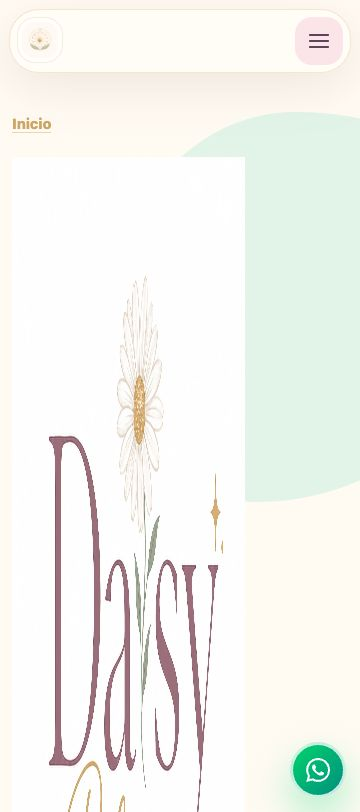

# Reporte de corrección del logo y recortes responsive

Fecha: 19 de junio de 2026  
Entorno validado: `http://127.0.0.1:8000/`  
Fuente servida confirmada: `/Users/danielfuentes/Documents/Daisy bloom 2/daisy-bloom-public_html/`

## Dictamen

`LOGO CORREGIDO — REQUIERE AJUSTES MENORES`

La corrección de código está validada: el logo ya conserva proporción en las 22 páginas, el footer dejó de crecer 1086 px, las seis páginas prioritarias no presentan overflow horizontal y las imágenes móviles permanecen entre 330 y 410 px de alto. El ajuste menor pendiente es documental: el motor de captura comenzó a repetir el primer viewport en capturas completas y después agotó tiempo; esas imágenes se descartaron en lugar de entregarlas como evidencia falsa.

Las seis páginas pueden mostrarse a Daisy como **revisión local guiada**, no como sitio terminado ni listo para publicación.

## Respaldo

Antes de modificar se respaldaron los 22 archivos `index.html` fuera de `public_html`:

- Carpeta: `/private/tmp/daisy-bloom-logo-responsive-backup-20260619/`
- Archivo: `index-html-antes.tar`
- Manifiesto: `archivos-respaldados.txt`
- Huellas: `index-html-sha256-antes.txt`

No se crearon copias `backup`, `old` o `final` dentro del sitio público.

## Diagnóstico físico del logo

| Propiedad | Logo principal | Emblema |
| --- | --- | --- |
| Archivo | `daisy-bloom-logo-principal.webp` | `daisy-bloom-logo-emblema.webp` |
| Dimensiones | 1448×1086 px | 512×512 px |
| Proporción del lienzo | 1.333:1 | 1:1 |
| MIME real | `image/webp` | `image/webp` |
| Codificación | WebP VP8 | WebP VP8 |
| Peso | 70,030 bytes | 14,814 bytes |
| Color/transparencia | RGB, fondo blanco, sin canal alfa | RGB, fondo blanco, sin canal alfa |
| Bounding box visible aproximada | `(231,118)–(1314,928)`, 1083×810 px | `(104,85)–(408,413)`, 304×328 px |
| Márgenes aproximados | 231 izq., 134 der., 118 sup., 158 inf. | 104 izq., 104 der., 85 sup., 99 inf. |

El contenido del logo principal ocupa aproximadamente 75% del ancho y 75% del alto. Los márgenes no justifican recortar el archivo. **No se creó `daisy-bloom-logo-principal-web.webp` y no se alteró el logo original.**

## Uso actual de los recursos

- Header y navegación móvil: `daisy-bloom-logo-emblema.webp` mediante `.brand-logo`.
- Favicon: `daisy-bloom-logo-emblema.webp`.
- Hero de las 22 páginas: `daisy-bloom-logo-principal.webp` mediante `.hero-logo-lockup`, aplicada al `` o a su wrapper según la plantilla.
- Footer de las 22 páginas: `daisy-bloom-logo-principal.webp` mediante `.footer-logo`.

## Causa raíz

El HTML declara `width="1448" height="1086"`. Las reglas anteriores reducían el ancho del hero a 230–250 px y el footer a 190 px, pero no establecían `height:auto`. Como resultado, el navegador conservaba la altura presentacional de 1086 px mientras reducía solamente el ancho.

Reglas anteriores relevantes:

```css
.hero-logo-lockup { width: min(230px, 62vw); }
.footer-logo { width: 190px; }
```

Reglas nuevas comunes:

```css
.hero-logo-lockup {
  display: block;
  height: auto;
  max-width: 100%;
  object-fit: contain;
}

.hero-logo-lockup > img {
  display: block;
  width: 100%;
  height: auto;
  max-width: 100%;
  object-fit: contain;
}

.footer-logo {
  display: block;
  height: auto;
  max-width: min(190px, 100%);
  object-fit: contain;
}
```

## Corrección responsive de imágenes

Solo en las seis páginas prioritarias se añadieron reglas acotadas para:

- permitir que las columnas grid se contraigan con `min-width: 0`;
- limitar figuras e imágenes a `max-width: 100%`;
- eliminar el margen lateral predeterminado de `<figure>`;
- mantener `display:block` y `object-fit:cover`;
- ajustar el foco de hero, Daisy como guía y CTA mediante `object-position` entre 26% y 34% vertical.

La medición precisa mostró que los valores 585–669 observados anteriormente eran anchos de cajas durante una prueba defectuosa, no alturas finales. Las alturas móviles reales ya estaban entre 330 y 410 px; no se impuso una altura única ni se comprimieron imágenes.

## Resultado medido

| Elemento | Antes | Después |
| --- | ---: | ---: |
| Logo del hero móvil | 198–233 × 1086 px | 198–233 × 149–174 px |
| Logo del hero desktop | 230–250 × 1086 px | 230–250 × 172–188 px |
| Logo de footer | 190 × 1086 px | 190 × 143 px |
| Emblema de header móvil | 44–46 px | Sin cambio |
| Imágenes móviles prioritarias | Diagnóstico inicial no confiable | 330–410 px de alto |
| Overflow horizontal | Oculto o dudoso | Cero en 30 combinaciones |

Viewports verificados: 320×800, 375×812, 768×1024, 1024×768 y 1440×1000.

## Regresión

- 22/22 páginas: logo de hero entre 172 y 174 px a 375 px; footer 143 px.
- 30/30 combinaciones prioritarias: `scrollWidth <= innerWidth`.
- Seis páginas prioritarias: cero imágenes rotas en las pruebas visibles.
- Menú móvil: abre y cierra; `aria-expanded` cambia correctamente.
- FAQ: abre y cierra; `aria-hidden` cambia correctamente.
- WhatsApp: enlaces `wa.me` conservados.
- Referencias gráficas: 326 apariciones y 150 rutas únicas, idénticas antes/después.
- Estado físico global sin cambio: 66 rutas existentes y 84 faltantes.
- 22/22 canonicals idénticos.
- 22/22 bloques JSON-LD idénticos.
- Al excluir `<style>`, los 22 HTML son idénticos al respaldo: no cambiaron textos, contenido, navegación ni JavaScript.
- `sitemap.xml` y `robots.txt` no fueron modificados.

## Archivos HTML modificados

Se modificaron exclusivamente los 22 `index.html` para la regla global del logo. Las reglas de recorte adicionales solo se aplicaron a los seis marcados con `*`:

- `index.html` *
- `belleza-que-florece/index.html` *
- `belleza-que-florece/cuidado-facial/index.html` *
- `belleza-que-florece/cuidado-corporal/index.html` *
- `belleza-que-florece/maquillaje-natural/index.html`
- `belleza-que-florece/piel-necesidades-especiales/index.html`
- `bienestar-diario/index.html`
- `bienestar-diario/bienestar-digestivo/index.html`
- `bienestar-diario/bienestar-femenino-40/index.html`
- `bienestar-diario/bienestar-general/index.html`
- `bienestar-diario/nutricion-consciente-suplementos/index.html`
- `bienestar-diario/nutricion-deportiva/index.html`
- `crece-con-daisy-bloom/index.html`
- `crece-con-daisy-bloom/comparte-tu-experiencia/index.html`
- `crece-con-daisy-bloom/construye-tu-comunidad/index.html`
- `crece-con-daisy-bloom/empieza-como-clienta/index.html`
- `crece-con-daisy-bloom/lidera-con-proposito/index.html`
- `vida-natural-bloom/index.html` *
- `vida-natural-bloom/descanso-calma-equilibrio/index.html` *
- `vida-natural-bloom/habitos-saludables/index.html`
- `vida-natural-bloom/hidratacion-alimentacion-consciente/index.html`
- `vida-natural-bloom/organizacion-estilo-de-vida/index.html`

## Capturas válidas

Antes, header móvil:



Después, header y hero móvil:


También se conserva la evidencia anterior del footer en `antes/inicio-footer-mobile-antes.png`. Las capturas completas repetidas o con secciones sin activar fueron eliminadas. Siguen pendientes las capturas completas confiables 375/1440 y las secciones hero/Daisy/CTA/footer debido al fallo del motor de captura, no a un fallo de la página.

## Páginas que pueden mostrarse a Daisy

Como revisión local guiada:

1. Inicio.
2. Belleza que Florece.
3. Cuidado Facial.
4. Cuidado Corporal.
5. Vida Natural Bloom.
6. Descanso, Calma y Equilibrio.

No se amplía la recomendación a las páginas con imágenes faltantes y no se declara el sitio completo.

## Confirmación de alcance

- No se creó un nuevo archivo de logo.
- No se rediseñó ni editó el logo.
- No se alteró ninguna imagen.
- No se modificaron textos, navegación, WhatsApp, FAQ ni JavaScript.
- No se modificaron canonical, Open Graph, Twitter Card, SEO ni schema.
- No se modificaron sitemap ni robots.
- No se publicaron cambios en Hostinger.
- Toda la validación se realizó únicamente en local.
